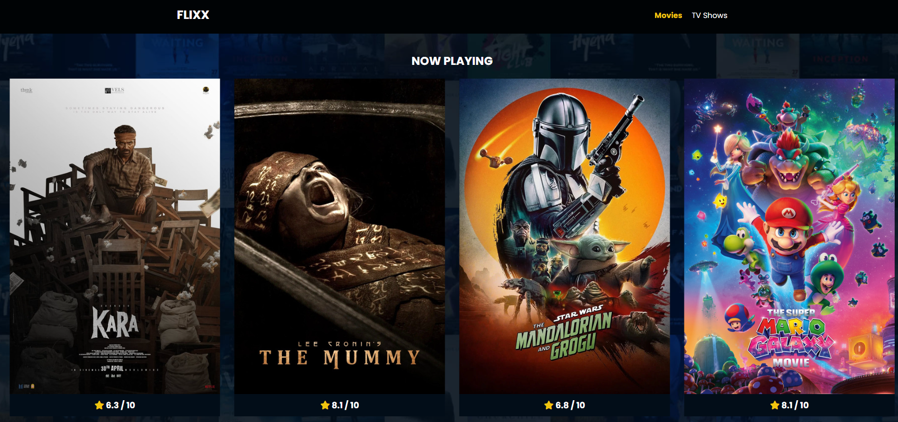
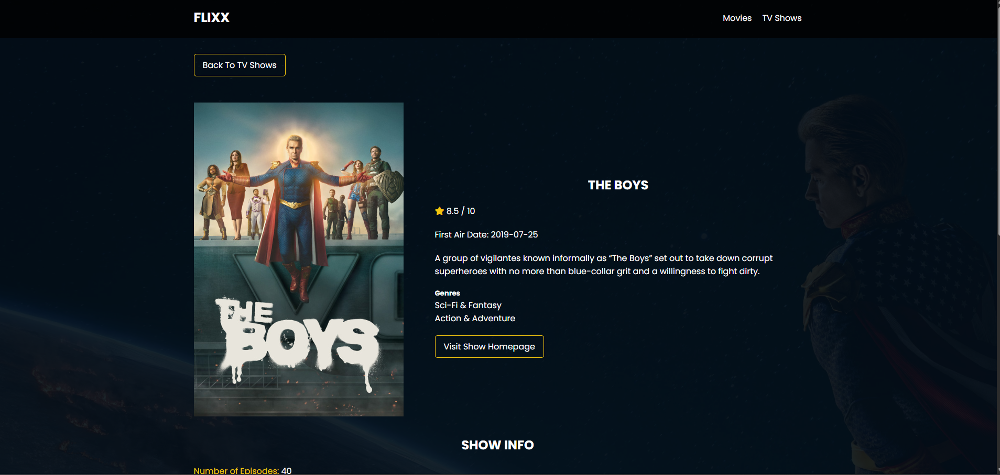
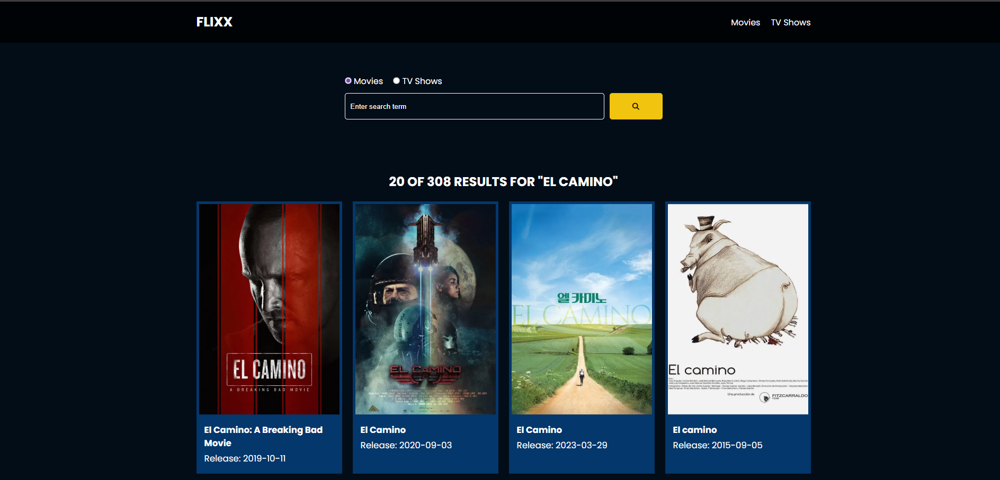

<div align="center">

# Flixx

**A movie and TV show discovery app powered by the TMDB API**

[](.)
[](.)
[](.)
[](https://www.themoviedb.org/documentation/api)

</div>

---

## Overview

Flixx is a vanilla JavaScript web app that lets users browse popular movies and TV shows, explore detailed information on any title, and search across both categories — all pulled live from The Movie Database (TMDB) API. No frameworks, no build tools; just HTML, CSS, and JavaScript.

---

## Features

- **Now Playing** — Swiper carousel of currently showing movies
- **Popular Movies & TV Shows** — Grid listings from TMDB's popularity rankings
- **Detail Pages** — Full info for any movie or show: overview, genres, rating, runtime, release date, budget, revenue, and backdrop image
- **Search** — Query movies or TV shows by title with result count and paginated listings
- **Loading Spinner** — Visual feedback while API requests are in flight

---

## Pages

| File | Route | Purpose |
|---|---|---|
| `index.html` | `/` | Now playing carousel + popular movies |
| `shows.html` | `/shows.html` | Popular TV shows grid |
| `movie-details.html` | `/movie-details.html?id=` | Single movie detail view |
| `tv-details.html` | `/tv-details.html?id=` | Single TV show detail view |
| `search.html` | `/search.html` | Search results for movies or TV shows |

---

## Tech Stack

| Layer | Technology |
|---|---|
| Markup | HTML5 |
| Styling | CSS3 (custom) + [Swiper.js](https://swiperjs.com/) |
| Icons | Font Awesome 6 (self-hosted) |
| Fonts | Poppins via Google Fonts |
| Scripting | Vanilla JavaScript (ES6+) |
| Data | [TMDB API v3](https://developers.themoviedb.org/3) |

---

## Project Structure

```
flixx-app/
├── index.html              # Home — now playing + popular movies
├── shows.html              # Popular TV shows
├── movie-details.html      # Movie detail view
├── tv-details.html         # TV show detail view
├── search.html             # Search results
├── css/
│   ├── style.css           # Main stylesheet
│   └── spinner.css         # Loading spinner styles
├── js/
│   └── script.js           # All app logic and API calls
├── lib/
│   ├── swiper.js           # Swiper carousel library
│   ├── swiper.css          # Swiper styles
│   └── fontawesome.css     # Icon library
├── images/
│   ├── showcase-bg.jpg     # Hero background
│   └── no-image.jpg        # Fallback for missing posters
└── webfonts/               # Self-hosted Font Awesome font files
```

---

## Getting Started

### 1. Get a TMDB API key

Sign up at [themoviedb.org](https://www.themoviedb.org/signup) → Settings → API → Request an API key (free).

### 2. Add your key to `js/script.js`

```js
const API_KEY = 'your_api_key_here';
```

### 3. Serve locally

Open with any static file server — for example with VS Code's Live Server extension, or:

```bash
npx serve .
```

> Opening `index.html` directly as a `file://` URL may cause CORS issues with the API. Use a local server.

---

## API Reference

All data comes from [TMDB API v3](https://developers.themoviedb.org/3). Endpoints used:

| Endpoint | Used For |
|---|---|
| `GET /movie/now_playing` | Now playing carousel |
| `GET /movie/popular` | Popular movies grid |
| `GET /tv/popular` | Popular TV shows grid |
| `GET /movie/{id}` | Movie detail page |
| `GET /tv/{id}` | TV show detail page |
| `GET /search/movie` | Movie search |
| `GET /search/tv` | TV show search |

---

## Screenshots






---

## License

This project is for educational purposes. Movie and TV data is provided by [The Movie Database (TMDB)](https://www.themoviedb.org/). TMDB is not endorsed or certified by this project.
